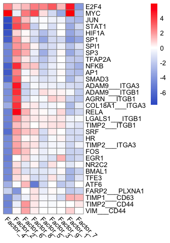

``` r
library(decoupleR)
library(liana)
library(moon)
library(readr)
library(pheatmap)
library(dplyr)
library(reshape2)
library(MOFA2)
library(ggplot2)
library(RCy3)
library(RColorBrewer)
library(cosmosR)

source("scripts/support_pheatmap_colors.R")
```

``` r
cell_line <- "MOLT-4"
## Get RNA raw values
RNA_raw <- as.data.frame(read_csv("data/RNA/RNA_log2_FPKM_clean.csv"))
```

    ## Rows: 11265 Columns: 61
    ## ── Column specification ────────────────────────────────────────────────────────
    ## Delimiter: ","
    ## chr  (1): Genes
    ## dbl (60): 786-0, A498, A549/ATCC, ACHN, BT-549, CAKI-1, CCRF-CEM, COLO 205, ...
    ## 
    ## ℹ Use `spec()` to retrieve the full column specification for this data.
    ## ℹ Specify the column types or set `show_col_types = FALSE` to quiet this message.

``` r
rownames(RNA_raw) <- RNA_raw[,1]
RNA_raw <- RNA_raw[,-1]
RNA_raw <- melt(as.data.frame(cbind(RNA_raw,row.names(RNA_raw))))
```

    ## Using row.names(RNA_raw) as id variables

``` r
RNA_raw$view <- "RNA"
RNA_raw <- RNA_raw[,c(2,1,4,3)]                 
names(RNA_raw) <- c("sample","feature","view","value")
RNA_raw <- RNA_raw[which(RNA_raw$sample == cell_line),]

model <- load_model('results/mofa/mofa_res_10factor.hdf5')
```

    ## Warning in load_model("results/mofa/mofa_res_10factor.hdf5"): There are duplicated features names across different views. We will add the suffix *_view* only for those features 
    ##             Example: if you have both TP53 in mRNA and mutation data it will be renamed to TP53_mRNA, TP53_mutation

    ## Warning in .quality_control(object, verbose = verbose): Factor(s) 1 are strongly correlated with the total number of expressed features for at least one of your omics. Such factors appear when there are differences in the total 'levels' between your samples, *sometimes* because of poor normalisation in the preprocessing steps.

``` r
meta_data <- read_csv("data/metadata/RNA_metadata_cluster.csv")[,c(1,2)]
```

    ## Rows: 60 Columns: 16
    ## ── Column specification ────────────────────────────────────────────────────────
    ## Delimiter: ","
    ## chr (12): cell_line, tissue of origin a, sex a, prior treatment a,b, Epithel...
    ## dbl  (4): cluster, age a, mdr f, doubling time g
    ## 
    ## ℹ Use `spec()` to retrieve the full column specification for this data.
    ## ℹ Specify the column types or set `show_col_types = FALSE` to quiet this message.

``` r
colnames(meta_data) <- c("sample","cluster")
samples_metadata(model) <- meta_data[meta_data$sample %in% samples_metadata(model)$sample,]

weights <- get_weights(model, views = "all", factors = "all")
RNA_MOFA <- data.frame(weights$RNA)
RNA_MOFA <- cbind(rownames(RNA_MOFA), RNA_MOFA)
colnames(RNA_MOFA)[1] <- c("feature")
RNA_MOFA$feature <- gsub("_RNA","",RNA_MOFA$feature)


weights <- data.frame(get_factors(model, factors = "all")$single_group)
Factor_MOFA <- cbind(rownames(weights), weights)
colnames(Factor_MOFA)[1] <- c("sample")
Factor_MOFA <- Factor_MOFA[which(Factor_MOFA$sample == cell_line),]
names(Factor_MOFA) <- gsub("Factor","Factor_Z_",names(Factor_MOFA))
```

``` r
## Calculate score
RNA_weight_cell_line <- merge(RNA_raw, RNA_MOFA, by.x='feature', by.y='feature')
names(RNA_weight_cell_line) <- gsub("Factor","Factor_W_", names(RNA_weight_cell_line))
RNA_weight_cell_line <- merge(RNA_weight_cell_line, Factor_MOFA, by.x='sample', by.y='sample')

cell_line_decomposed_RNA <- as.data.frame(do.call(cbind,lapply(1:9,function(x, RNA_weight_cell_line){
  RNA_weight_cell_line[,x+4] * RNA_weight_cell_line[,x+4+9]
},RNA_weight_cell_line = RNA_weight_cell_line)))

row.names(cell_line_decomposed_RNA) <- RNA_weight_cell_line$feature
names(cell_line_decomposed_RNA) <- gsub("V","Factor_",names(cell_line_decomposed_RNA))
```

``` r
# Load LIANA (receptor and ligand) consensus network
# ligrec_ressource <- distinct(liana::decomplexify(liana::select_resource("Consensus")[[1]]))
load("support/ligrec_ressource.RData")
ligrec_geneset <- ligrec_ressource[,c("source_genesymbol","target_genesymbol")]
ligrec_geneset$set <- paste(ligrec_geneset$source_genesymbol, ligrec_geneset$target_genesymbol, sep = "___")
ligrec_geneset <- reshape2::melt(ligrec_geneset, id.vars = "set")[,c(3,1)]
names(ligrec_geneset)[1] <- "gene"
ligrec_geneset$mor <- 1
ligrec_geneset$likelihood <- 1
ligrec_geneset <- distinct(ligrec_geneset)

# Load Dorothea (TF) network
load("support/dorothea_df.RData")
```

``` r
ligrec_scores <- run_ulm(mat = as.matrix(cell_line_decomposed_RNA), network = ligrec_geneset, .source = set, .target = gene, minsize = 2)
ligrec_scores_df <- reshape2::dcast(ligrec_scores,source~condition, value.var = "score")
row.names(ligrec_scores_df) <- ligrec_scores_df$source
ligrec_scores_df <- ligrec_scores_df[,-1]

TF_scores <- run_ulm(mat = as.matrix(cell_line_decomposed_RNA), network = dorothea_df, minsize = 10)
TF_scores_df <- reshape2::dcast(TF_scores,source~condition, value.var = "score")
row.names(TF_scores_df) <- TF_scores_df$source
TF_scores_df <- TF_scores_df[,-1]
```

``` r
# ligrec_scores_df_top <- ligrec_scores_df[c("TIMP2___ITGB1","VIM___CD44"),]
ligrec_scores_df_top <- ligrec_scores_df[apply(ligrec_scores_df,1,function(x){max(abs(x)) > 4}),]

TF_scores_df_top <- TF_scores_df[apply(TF_scores_df,1,function(x){max(abs(x)) > 4.5}),]

top_score_df <- as.data.frame(rbind(ligrec_scores_df_top, TF_scores_df_top))

t <- as.vector(t(top_score_df))
palette1 <- createLinearColors(t[t < 0],withZero = F , maximum = abs(min(t,na.rm = T)) * 10)
palette2 <- createLinearColors(t[t > 0],withZero = F , maximum = abs(max(t,na.rm = T)) * 10)
palette <- c(palette1, palette2)
# pheatmap(top_score_df, show_rownames = T, cluster_cols = F, cluster_rows = F,color = palette, angle_col = 315, filename = "results/mofa/mofa_top_TF.pdf", width = 4, height = 4.3)
pheatmap(top_score_df, show_rownames = T, cluster_cols = T, cluster_rows = T,color = palette, angle_col = 315, treeheight_row = 0, treeheight_col = 0)
```

<!-- -->

``` r
pheatmap(top_score_df, show_rownames = T, cluster_cols = T, cluster_rows = T,color = palette, angle_col = 315, treeheight_row = 0, treeheight_col = 0, filename = paste("results/mofa/",paste(cell_line,"_top_TF_LR.pdf",sep =""),sep = ""), width = 3.5, height = 5)
```
