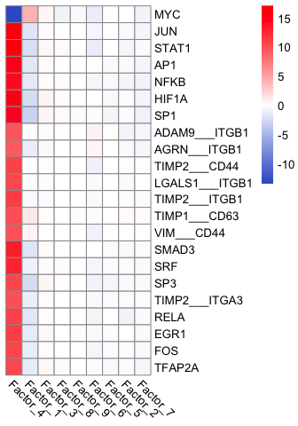
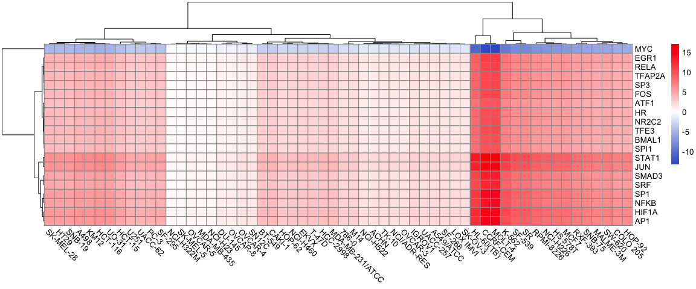
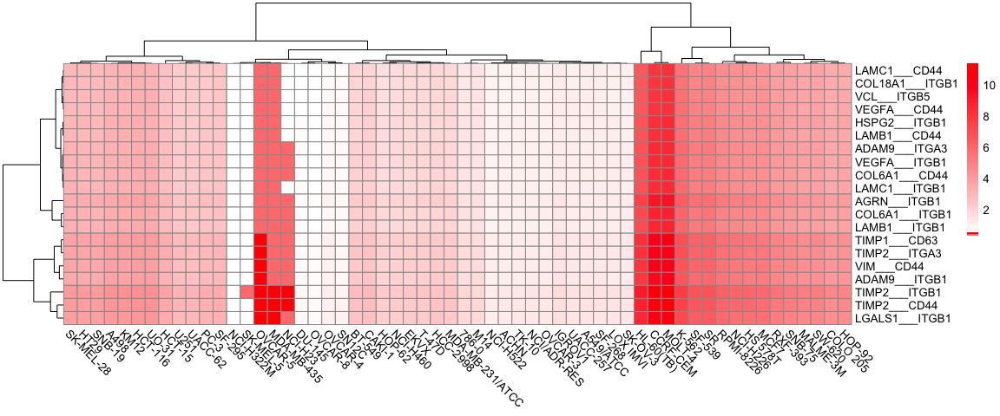
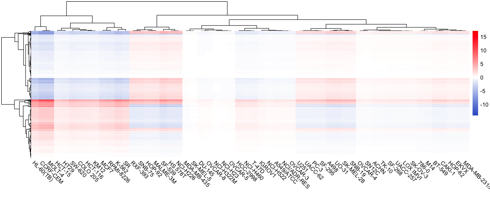
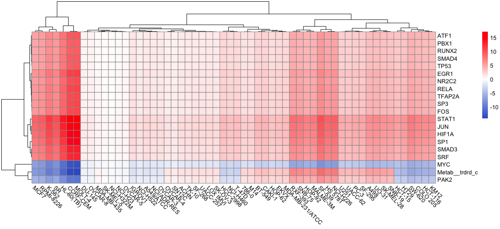

    library(decoupleR)
    library(liana)
    library(moon)
    library(readr)
    library(pheatmap)
    library(dplyr)
    library(reshape2)
    library(MOFA2)
    library(ggplot2)
    library(RCy3)
    library(RColorBrewer)
    library(cosmosR)
    library(data.table)
    library(cosmosR)

    source("scripts/support_pheatmap_colors.R")
    source("scripts/support_functions.R")

    ## Get RNA raw values
    RNA_raw <- as.data.frame(read_csv("data/RNA/RNA_log2_FPKM_clean.csv"))

    ## Rows: 11265 Columns: 61
    ## ── Column specification ────────────────────────────────────────────────────────
    ## Delimiter: ","
    ## chr  (1): Genes
    ## dbl (60): 786-0, A498, A549/ATCC, ACHN, BT-549, CAKI-1, CCRF-CEM, COLO 205, ...
    ## 
    ## ℹ Use `spec()` to retrieve the full column specification for this data.
    ## ℹ Specify the column types or set `show_col_types = FALSE` to quiet this message.

    rownames(RNA_raw) <- RNA_raw[,1]
    RNA_raw <- RNA_raw[,-1]
    RNA_raw <- melt(as.data.frame(cbind(RNA_raw,row.names(RNA_raw))))

    ## Warning in melt(as.data.frame(cbind(RNA_raw, row.names(RNA_raw)))): The melt
    ## generic in data.table has been passed a data.frame and will attempt to redirect
    ## to the relevant reshape2 method; please note that reshape2 is deprecated, and
    ## this redirection is now deprecated as well. To continue using melt methods from
    ## reshape2 while both libraries are attached, e.g. melt.list, you can prepend the
    ## namespace like reshape2::melt(as.data.frame(cbind(RNA_raw,
    ## row.names(RNA_raw)))). In the next version, this warning will become an error.

    ## Using row.names(RNA_raw) as id variables

    RNA_raw$view <- "RNA"
    RNA_raw <- RNA_raw[,c(2,1,4,3)]                 
    names(RNA_raw) <- c("sample","feature","view","value")

    cell_lines <- unique(RNA_raw$sample)
    cell_line <- "MOLT-4"

    RNA_raw <- RNA_raw[which(RNA_raw$sample == cell_line),]

    model <- load_model('results/mofa/mofa_res_10factor.hdf5')

    ## Warning in load_model("results/mofa/mofa_res_10factor.hdf5"): There are duplicated features names across different views. We will add the suffix *_view* only for those features 
    ##             Example: if you have both TP53 in mRNA and mutation data it will be renamed to TP53_mRNA, TP53_mutation

    ## Warning in .quality_control(object, verbose = verbose): Factor(s) 1 are strongly correlated with the total number of expressed features for at least one of your omics. Such factors appear when there are differences in the total 'levels' between your samples, *sometimes* because of poor normalisation in the preprocessing steps.

    meta_data <- read_csv("data/metadata/RNA_metadata_cluster.csv")[,c(1,2)]

    ## Rows: 60 Columns: 16
    ## ── Column specification ────────────────────────────────────────────────────────
    ## Delimiter: ","
    ## chr (12): cell_line, tissue of origin a, sex a, prior treatment a,b, Epithel...
    ## dbl  (4): cluster, age a, mdr f, doubling time g
    ## 
    ## ℹ Use `spec()` to retrieve the full column specification for this data.
    ## ℹ Specify the column types or set `show_col_types = FALSE` to quiet this message.

    colnames(meta_data) <- c("sample","cluster")
    samples_metadata(model) <- meta_data[meta_data$sample %in% samples_metadata(model)$sample,]

    weights <- get_weights(model, views = "all", factors = "all")
    RNA_MOFA <- data.frame(weights$RNA)
    RNA_MOFA <- cbind(rownames(RNA_MOFA), RNA_MOFA)
    colnames(RNA_MOFA)[1] <- c("feature")
    RNA_MOFA$feature <- gsub("_RNA","",RNA_MOFA$feature)

    Z_matrix <- data.frame(get_factors(model, factors = "all")$single_group)
    Factor_MOFA <- cbind(rownames(Z_matrix), Z_matrix)
    colnames(Factor_MOFA)[1] <- c("sample")
    Factor_MOFA <- Factor_MOFA[which(Factor_MOFA$sample == cell_line),]
    names(Factor_MOFA) <- gsub("Factor","Factor_Z_",names(Factor_MOFA))

    ## Calculate score
    RNA_weight_cell_line <- merge(RNA_raw, RNA_MOFA, by.x='feature', by.y='feature')
    names(RNA_weight_cell_line) <- gsub("Factor","Factor_W_", names(RNA_weight_cell_line))
    RNA_weight_cell_line <- merge(RNA_weight_cell_line, Factor_MOFA, by.x='sample', by.y='sample')

    cell_line_decomposed_RNA <- as.data.frame(do.call(cbind,lapply(1:9,function(x, RNA_weight_cell_line){
      RNA_weight_cell_line[,x+4] * RNA_weight_cell_line[,x+4+9]
    },RNA_weight_cell_line = RNA_weight_cell_line)))

    row.names(cell_line_decomposed_RNA) <- RNA_weight_cell_line$feature
    names(cell_line_decomposed_RNA) <- gsub("V","Factor_",names(cell_line_decomposed_RNA))

    # Load LIANA (receptor and ligand) consensus network
    # ligrec_ressource <- distinct(liana::decomplexify(liana::select_resource("Consensus")[[1]]))
    load("support/ligrec_ressource.RData")
    ligrec_geneset <- ligrec_ressource[,c("source_genesymbol","target_genesymbol")]
    ligrec_geneset$set <- paste(ligrec_geneset$source_genesymbol, ligrec_geneset$target_genesymbol, sep = "___")
    ligrec_geneset <- reshape2::melt(ligrec_geneset, id.vars = "set")[,c(3,1)]
    names(ligrec_geneset)[1] <- "gene"
    ligrec_geneset$mor <- 1
    ligrec_geneset$likelihood <- 1
    ligrec_geneset <- distinct(ligrec_geneset)

    # Load Dorothea (TF) network
    load("support/dorothea_df.RData")

    scaling_factor_Z <- as.numeric(Factor_MOFA[cell_line,-1])
    ligrec_scores <- run_ulm(mat = as.matrix(cell_line_decomposed_RNA), network = ligrec_geneset, .source = set, .target = gene, minsize = 2)
    ligrec_scores_df <- reshape2::dcast(ligrec_scores,source~condition, value.var = "score")
    row.names(ligrec_scores_df) <- ligrec_scores_df$source
    ligrec_scores_df <- ligrec_scores_df[,-1]
    ligrec_scores_df <- as.data.frame(t(apply(ligrec_scores_df, 1, function(x, scaling_factor_Z){
      return(x * scaling_factor_Z)
    }, scaling_factor_Z = scaling_factor_Z)))

    TF_scores <- run_ulm(mat = as.matrix(cell_line_decomposed_RNA), network = dorothea_df, minsize = 10)
    TF_scores_df <- reshape2::dcast(TF_scores,source~condition, value.var = "score")
    row.names(TF_scores_df) <- TF_scores_df$source
    TF_scores_df <- TF_scores_df[,-1]
    TF_scores_df <- as.data.frame(t(apply(TF_scores_df, 1, function(x, scaling_factor_Z){
      return(x * scaling_factor_Z)
    }, scaling_factor_Z = scaling_factor_Z)))

    # ligrec_scores_df_top <- ligrec_scores_df[c("TIMP2___ITGB1","VIM___CD44"),]
    ligrec_scores_df_top <- ligrec_scores_df[apply(ligrec_scores_df,1,function(x){max(abs(x)) > 9}),]

    TF_scores_df_top <- TF_scores_df[apply(TF_scores_df,1,function(x){max(abs(x)) > 10.5}),]

    top_score_df <- as.data.frame(rbind(ligrec_scores_df_top, TF_scores_df_top))

    t <- as.vector(t(top_score_df))
    palette1 <- createLinearColors(t[t < 0],withZero = F , maximum = abs(min(t,na.rm = T)) * 10)
    palette2 <- createLinearColors(t[t > 0],withZero = F , maximum = abs(max(t,na.rm = T)) * 10)
    palette <- c(palette1, palette2)
    # pheatmap(top_score_df, show_rownames = T, cluster_cols = F, cluster_rows = F,color = palette, angle_col = 315, filename = "results/mofa/mofa_top_TF.pdf", width = 4, height = 4.3)
    pheatmap(top_score_df, show_rownames = T, cluster_cols = T, cluster_rows = T,color = palette, angle_col = 315, treeheight_row = 0, treeheight_col = 0)

    pheatmap(top_score_df, show_rownames = T, cluster_cols = T, cluster_rows = T,color = palette, angle_col = 315, treeheight_row = 0, treeheight_col = 0, filename = paste("results/mofa/",paste(cell_line,"_top_TF_LR.pdf",sep =""),sep = ""), width = 3.5, height = 5)

    factor_n <- 4

    Z_matrix <- data.frame(get_factors(model, factors = "all")$single_group)
    Factor_MOFA <- cbind(rownames(Z_matrix), Z_matrix)
    colnames(Factor_MOFA)[1] <- c("sample")

    RNA_raw <- as.data.frame(read_csv("data/RNA/RNA_log2_FPKM_clean.csv"))

    ## Rows: 11265 Columns: 61
    ## ── Column specification ────────────────────────────────────────────────────────
    ## Delimiter: ","
    ## chr  (1): Genes
    ## dbl (60): 786-0, A498, A549/ATCC, ACHN, BT-549, CAKI-1, CCRF-CEM, COLO 205, ...
    ## 
    ## ℹ Use `spec()` to retrieve the full column specification for this data.
    ## ℹ Specify the column types or set `show_col_types = FALSE` to quiet this message.

    rownames(RNA_raw) <- RNA_raw[,1]
    RNA_raw <- RNA_raw[,-1]
    RNA_raw <- melt(as.data.frame(cbind(RNA_raw,row.names(RNA_raw))))

    ## Warning in melt(as.data.frame(cbind(RNA_raw, row.names(RNA_raw)))): The melt
    ## generic in data.table has been passed a data.frame and will attempt to redirect
    ## to the relevant reshape2 method; please note that reshape2 is deprecated, and
    ## this redirection is now deprecated as well. To continue using melt methods from
    ## reshape2 while both libraries are attached, e.g. melt.list, you can prepend the
    ## namespace like reshape2::melt(as.data.frame(cbind(RNA_raw,
    ## row.names(RNA_raw)))). In the next version, this warning will become an error.

    ## Using row.names(RNA_raw) as id variables

    RNA_raw$view <- "RNA"
    RNA_raw <- RNA_raw[,c(2,1,4,3)]                 
    names(RNA_raw) <- c("sample","feature","view","value")

    factor_reconstructed_RNA <- sapply(as.character(cell_lines), function(cell_line, Factor_MOFA,RNA_raw, RNA_MOFA, factor_n){
      Factor_MOFA_cl <- Factor_MOFA[which(Factor_MOFA$sample == cell_line),]
      names(Factor_MOFA_cl) <- gsub("Factor","Factor_Z_",names(Factor_MOFA_cl))
      
      RNA_raw_cl <- RNA_raw[which(RNA_raw$sample == cell_line),]
      
      RNA_weight_cell_line <- merge(RNA_raw_cl, RNA_MOFA, by.x='feature', by.y='feature')
      names(RNA_weight_cell_line) <- gsub("Factor","Factor_W_", names(RNA_weight_cell_line))
      RNA_weight_cell_line <- merge(RNA_weight_cell_line, Factor_MOFA_cl, by.x='sample', by.y='sample')
      
      reconstructed_RNA <- RNA_weight_cell_line[,factor_n+4] * RNA_weight_cell_line[,factor_n+4+9]
      names(reconstructed_RNA) <- RNA_weight_cell_line$feature
      return(reconstructed_RNA)
    }, Factor_MOFA = Factor_MOFA, RNA_raw = RNA_raw, RNA_MOFA = RNA_MOFA, factor_n = factor_n)

    factor_reconstructed_RNA_df <- as.data.frame(do.call(cbind,factor_reconstructed_RNA))
    row.names(factor_reconstructed_RNA_df) <- names(factor_reconstructed_RNA[[1]])

    # factor_reconstructed_TF <- as.data.frame(run_wmean(factor_reconstructed_RNA_df, network = dorothea_df, times = 2, minsize = 10))
    # factor_reconstructed_TF <- factor_reconstructed_TF[factor_reconstructed_TF$statistic == "wmean",]
    factor_reconstructed_TF <- as.data.frame(run_ulm(factor_reconstructed_RNA_df, network = dorothea_df, minsize = 10))
    factor_reconstructed_TF_df <- reshape2::dcast(factor_reconstructed_TF,source~condition, value.var = "score")
    row.names(factor_reconstructed_TF_df) <- factor_reconstructed_TF_df$source
    factor_reconstructed_TF_df <- factor_reconstructed_TF_df[,-1]

    Factor_Z <- Factor_MOFA[,1+factor_n]
    names(Factor_Z) <- Factor_MOFA[,1]

    Factor_Z <- Factor_Z[names(factor_reconstructed_TF_df)]

    factor_reconstructed_TF_df_scaledZ <- as.data.frame(t(apply(factor_reconstructed_TF_df, 1, function(x, Factor_Z){
      return(x * Factor_Z)
    }, Factor_Z = Factor_Z)))

    factor_reconstructed_TF_df_scaledZ_top <- factor_reconstructed_TF_df_scaledZ[order(abs(factor_reconstructed_TF_df_scaledZ$`MOLT-4`), decreasing = T),]
    factor_reconstructed_TF_df_scaledZ_top <- factor_reconstructed_TF_df_scaledZ_top[1:20,]

    palette <- make_heatmap_color_palette(factor_reconstructed_TF_df_scaledZ_top)
    pheatmap(factor_reconstructed_TF_df_scaledZ_top, show_rownames = T,color = palette, angle_col = 315)

    # factor_reconstructed_TF <- as.data.frame(run_wmean(factor_reconstructed_RNA_df, network = dorothea_df, times = 2, minsize = 10))
    # factor_reconstructed_TF <- factor_reconstructed_TF[factor_reconstructed_TF$statistic == "wmean",]
    factor_reconstructed_LR <- as.data.frame(run_ulm(factor_reconstructed_RNA_df, network = ligrec_geneset, .source = set, .target = gene, minsize = 2))
    factor_reconstructed_LR_df <- reshape2::dcast(factor_reconstructed_LR,source~condition, value.var = "score")
    row.names(factor_reconstructed_LR_df) <- factor_reconstructed_LR_df$source
    factor_reconstructed_LR_df <- factor_reconstructed_LR_df[,-1]

    Factor_Z <- Factor_MOFA[,1+factor_n]
    names(Factor_Z) <- Factor_MOFA[,1]

    Factor_Z <- Factor_Z[names(factor_reconstructed_LR_df)]

    factor_reconstructed_LR_df_scaledZ <- as.data.frame(t(apply(factor_reconstructed_LR_df, 1, function(x, Factor_Z){
      return(x * Factor_Z)
    }, Factor_Z = Factor_Z)))

    factor_reconstructed_LR_df_scaledZ_top <- factor_reconstructed_LR_df_scaledZ[order(abs(factor_reconstructed_LR_df_scaledZ$`MOLT-4`), decreasing = T),]
    factor_reconstructed_LR_df_scaledZ_top <- factor_reconstructed_LR_df_scaledZ_top[1:20,]

    palette <- make_heatmap_color_palette(factor_reconstructed_LR_df_scaledZ_top)

    ## Warning in min(numbers, na.rm = T): no non-missing arguments to min; returning
    ## Inf

    pheatmap(factor_reconstructed_LR_df_scaledZ_top, show_rownames = T,color = palette, angle_col = 315)

    load("support/meta_network.RData")

    meta_network <- meta_network_cleanup(meta_network)

    ## Warning: `summarise_each()` was deprecated in dplyr 0.7.0.
    ## ℹ Please use `across()` instead.
    ## ℹ The deprecated feature was likely used in the cosmosR package.
    ##   Please report the issue at <https://github.com/saezlab/COSMOSR/issues>.
    ## This warning is displayed once every 8 hours.
    ## Call `lifecycle::last_lifecycle_warnings()` to see where this warning was
    ## generated.

    ## Warning: `funs()` was deprecated in dplyr 0.8.0.
    ## ℹ Please use a list of either functions or lambdas:
    ## 
    ## # Simple named list: list(mean = mean, median = median)
    ## 
    ## # Auto named with `tibble::lst()`: tibble::lst(mean, median)
    ## 
    ## # Using lambdas list(~ mean(., trim = .2), ~ median(., na.rm = TRUE))
    ## ℹ The deprecated feature was likely used in the cosmosR package.
    ##   Please report the issue at <https://github.com/saezlab/COSMOSR/issues>.
    ## This warning is displayed once every 8 hours.
    ## Call `lifecycle::last_lifecycle_warnings()` to see where this warning was
    ## generated.

    expressed_genes <- as.data.frame(read_csv("data/RNA/RNA_log2_FPKM_clean.csv"))

    ## Rows: 11265 Columns: 61
    ## ── Column specification ────────────────────────────────────────────────────────
    ## Delimiter: ","
    ## chr  (1): Genes
    ## dbl (60): 786-0, A498, A549/ATCC, ACHN, BT-549, CAKI-1, CCRF-CEM, COLO 205, ...
    ## 
    ## ℹ Use `spec()` to retrieve the full column specification for this data.
    ## ℹ Specify the column types or set `show_col_types = FALSE` to quiet this message.

    expressed_genes <- setNames(rep(1,length(expressed_genes[,1])), expressed_genes$Genes)
    meta_network_filtered <- cosmosR:::filter_pkn_expressed_genes(names(expressed_genes), meta_pkn = meta_network)

    ## [1] "COSMOS: removing unexpressed nodes from PKN..."
    ## [1] "COSMOS: 15353 interactions removed"

    cell_lines <- names(factor_reconstructed_LR_df_scaledZ)
    moon_res_rec_to_TF_factor_reconstructed <- sapply(as.character(cell_lines), FUN = function(cell_line,
                                                                           factor_reconstructed_LR_df_scaledZ, 
                                                                           factor_reconstructed_TF_df_scaledZ, 
                                                                           factor_reconstructed_RNA_df, 
                                                                           meta_network_filtered){
      receptor_scores <- factor_reconstructed_LR_df_scaledZ[,cell_line,drop = F]
      receptor_scores$receptor <- gsub(".*___","",row.names(receptor_scores))
      receptor_scores <- as.data.table(receptor_scores)
      
      receptor_scores <- as.data.frame(receptor_scores[, lapply(.SD, mean), by = .(receptor), .SDcols = colnames(receptor_scores)[!colnames(receptor_scores) %in% 'receptor']])
      receptor_scores <- setNames(receptor_scores[,2], receptor_scores$receptor)
      
      TF_scores <- factor_reconstructed_TF_df_scaledZ[,cell_line]
      names(TF_scores) <- row.names(factor_reconstructed_TF_df_scaledZ)
      
      upstream_inputs <- receptor_scores
      upstream_inputs <- upstream_inputs[order(abs(upstream_inputs), decreasing = T)]
      upstream_inputs <- upstream_inputs[1:20]
      downstream_inputs <- TF_scores
      
      RNA_input <- factor_reconstructed_RNA_df[,cell_line] * Factor_Z[cell_line]
      names(RNA_input) <- row.names(factor_reconstructed_RNA_df)
      
      n_steps <- 6
      
      upstream_inputs_filtered <- cosmosR:::filter_input_nodes_not_in_pkn(upstream_inputs, meta_network_filtered)
      downstream_inputs_filtered <- cosmosR:::filter_input_nodes_not_in_pkn(downstream_inputs, meta_network_filtered)
      
      # in this step we prune the network to keep only the relevant part between upstream and downstream nodes
      meta_network_filtered_cellline <- cosmosR:::keep_controllable_neighbours(meta_network_filtered
                                                             , n_steps, 
                                                             names(upstream_inputs_filtered))
      downstream_inputs_filtered <- cosmosR:::filter_input_nodes_not_in_pkn(downstream_inputs_filtered, meta_network_filtered_cellline)
      meta_network_filtered <- cosmosR:::keep_observable_neighbours(meta_network_filtered_cellline, n_steps, names(downstream_inputs_filtered))
      upstream_inputs_filtered <- cosmosR:::filter_input_nodes_not_in_pkn(upstream_inputs_filtered, meta_network_filtered_cellline)
      
      meta_network_filtered_cellline_list <- compress_same_children(meta_network_filtered_cellline, sig_input = upstream_inputs_filtered, metab_input = downstream_inputs_filtered)
      
      meta_network_compressed_cellline <- meta_network_filtered_cellline_list$compressed_network
      
      meta_network_compressed_cellline <- meta_network_cleanup(meta_network_compressed_cellline)
      
      meta_network_rec_to_TF <- meta_network_compressed_cellline

      #We run moon in a loop until TF-target coherence convergences
      before <- 1
      after <- 0
      i <- 1
      while (before != after & i < 10) {
        before <- length(meta_network_rec_to_TF[,1])
        moon_res <- cosmosR::moon(upstream_input = upstream_inputs_filtered, 
                                                       downstream_input = downstream_inputs_filtered, 
                                                       meta_network = meta_network_rec_to_TF, 
                                                       n_layers = n_steps, 
                                                       statistic = "ulm") 
        
        meta_network_rec_to_TF <- filter_incohrent_TF_target(moon_res, dorothea_df, meta_network_rec_to_TF, RNA_input)
      
        
        after <- length(meta_network_rec_to_TF[,1])
        i <- i + 1
      }
      
      moon_res <- decompress_moon_result(moon_res, meta_network_filtered_cellline_list, meta_network_rec_to_TF)
      
      moon_res[moon_res$level != 0,"score"] <- moon_res[moon_res$level != 0,"score"] * Factor_Z[cell_line]
      moon_res <-  moon_res[,c(4,2)]
      names(moon_res)[2] <- cell_line

      return(moon_res)
      
    }, USE.NAMES = T, 
    simplify = F, 
    factor_reconstructed_LR_df_scaledZ = factor_reconstructed_LR_df_scaledZ, 
    factor_reconstructed_TF_df_scaledZ = factor_reconstructed_TF_df_scaledZ, 
    factor_reconstructed_RNA_df = factor_reconstructed_RNA_df,
    meta_network_filtered = meta_network_filtered)

    ## [1] "COSMOS: 3 input/measured nodes are not in PKN any more: CD63, LRP10, DCBLD2 and 0 more."
    ## [1] "COSMOS: 85 input/measured nodes are not in PKN any more: AP1, AR, ASCL1, ATF5, BMAL1, CDX2 and 79 more."
    ## [1] "COSMOS: removing nodes that are not reachable from inputs within 6 steps"
    ## [1] "COSMOS: 30451 from  47438 interactions are removed from the PKN"
    ## [1] "COSMOS: 14 input/measured nodes are not in PKN any more: CEBPD, DNMT3B, ESRRA, HSF2, KLF10, KLF2 and 8 more."
    ## [1] "COSMOS: removing nodes that are not observable by measurements within 6 steps"
    ## [1] "COSMOS: 8714 from  16987 interactions are removed from the PKN"
    ## [1] 2
    ## [1] 3
    ## [1] 4
    ## [1] 5
    ## [1] 6
    ## [1] 2
    ## [1] 3
    ## [1] 4
    ## [1] 5
    ## [1] 6
    ## [1] "COSMOS: 3 input/measured nodes are not in PKN any more: CD63, LRP10, DCBLD2 and 0 more."
    ## [1] "COSMOS: 85 input/measured nodes are not in PKN any more: AP1, AR, ASCL1, ATF5, BMAL1, CDX2 and 79 more."
    ## [1] "COSMOS: removing nodes that are not reachable from inputs within 6 steps"
    ## [1] "COSMOS: 30451 from  47438 interactions are removed from the PKN"
    ## [1] "COSMOS: 14 input/measured nodes are not in PKN any more: CEBPD, DNMT3B, ESRRA, HSF2, KLF10, KLF2 and 8 more."
    ## [1] "COSMOS: removing nodes that are not observable by measurements within 6 steps"
    ## [1] "COSMOS: 8714 from  16987 interactions are removed from the PKN"
    ## [1] 2
    ## [1] 3
    ## [1] 4
    ## [1] 5
    ## [1] 6
    ## [1] 2
    ## [1] 3
    ## [1] 4
    ## [1] 5
    ## [1] 6
    ## [1] "COSMOS: 3 input/measured nodes are not in PKN any more: CD63, LRP10, DCBLD2 and 0 more."
    ## [1] "COSMOS: 85 input/measured nodes are not in PKN any more: AP1, AR, ASCL1, ATF5, BMAL1, CDX2 and 79 more."
    ## [1] "COSMOS: removing nodes that are not reachable from inputs within 6 steps"
    ## [1] "COSMOS: 30451 from  47438 interactions are removed from the PKN"
    ## [1] "COSMOS: 14 input/measured nodes are not in PKN any more: CEBPD, DNMT3B, ESRRA, HSF2, KLF10, KLF2 and 8 more."
    ## [1] "COSMOS: removing nodes that are not observable by measurements within 6 steps"
    ## [1] "COSMOS: 8714 from  16987 interactions are removed from the PKN"
    ## [1] 2
    ## [1] 3
    ## [1] 4
    ## [1] 5
    ## [1] 6
    ## [1] 2
    ## [1] 3
    ## [1] 4
    ## [1] 5
    ## [1] 6
    ## [1] "COSMOS: 3 input/measured nodes are not in PKN any more: CD63, LRP10, DCBLD2 and 0 more."
    ## [1] "COSMOS: 85 input/measured nodes are not in PKN any more: AP1, AR, ASCL1, ATF5, BMAL1, CDX2 and 79 more."
    ## [1] "COSMOS: removing nodes that are not reachable from inputs within 6 steps"
    ## [1] "COSMOS: 30451 from  47438 interactions are removed from the PKN"
    ## [1] "COSMOS: 14 input/measured nodes are not in PKN any more: CEBPD, DNMT3B, ESRRA, HSF2, KLF10, KLF2 and 8 more."
    ## [1] "COSMOS: removing nodes that are not observable by measurements within 6 steps"
    ## [1] "COSMOS: 8714 from  16987 interactions are removed from the PKN"
    ## [1] 2
    ## [1] 3
    ## [1] 4
    ## [1] 5
    ## [1] 6
    ## [1] 2
    ## [1] 3
    ## [1] 4
    ## [1] 5
    ## [1] 6
    ## [1] "COSMOS: 3 input/measured nodes are not in PKN any more: CD63, LRP10, DCBLD2 and 0 more."
    ## [1] "COSMOS: 85 input/measured nodes are not in PKN any more: AP1, AR, ASCL1, ATF5, BMAL1, CDX2 and 79 more."
    ## [1] "COSMOS: removing nodes that are not reachable from inputs within 6 steps"
    ## [1] "COSMOS: 30451 from  47438 interactions are removed from the PKN"
    ## [1] "COSMOS: 14 input/measured nodes are not in PKN any more: CEBPD, DNMT3B, ESRRA, HSF2, KLF10, KLF2 and 8 more."
    ## [1] "COSMOS: removing nodes that are not observable by measurements within 6 steps"
    ## [1] "COSMOS: 8714 from  16987 interactions are removed from the PKN"
    ## [1] 2
    ## [1] 3
    ## [1] 4
    ## [1] 5
    ## [1] 6
    ## [1] 2
    ## [1] 3
    ## [1] 4
    ## [1] 5
    ## [1] 6
    ## [1] "COSMOS: 3 input/measured nodes are not in PKN any more: CD63, LRP10, DCBLD2 and 0 more."
    ## [1] "COSMOS: 85 input/measured nodes are not in PKN any more: AP1, AR, ASCL1, ATF5, BMAL1, CDX2 and 79 more."
    ## [1] "COSMOS: removing nodes that are not reachable from inputs within 6 steps"
    ## [1] "COSMOS: 30451 from  47438 interactions are removed from the PKN"
    ## [1] "COSMOS: 14 input/measured nodes are not in PKN any more: CEBPD, DNMT3B, ESRRA, HSF2, KLF10, KLF2 and 8 more."
    ## [1] "COSMOS: removing nodes that are not observable by measurements within 6 steps"
    ## [1] "COSMOS: 8714 from  16987 interactions are removed from the PKN"
    ## [1] 2
    ## [1] 3
    ## [1] 4
    ## [1] 5
    ## [1] 6
    ## [1] 2
    ## [1] 3
    ## [1] 4
    ## [1] 5
    ## [1] 6
    ## [1] "COSMOS: 3 input/measured nodes are not in PKN any more: CD63, LRP10, DCBLD2 and 0 more."
    ## [1] "COSMOS: 85 input/measured nodes are not in PKN any more: AP1, AR, ASCL1, ATF5, BMAL1, CDX2 and 79 more."
    ## [1] "COSMOS: removing nodes that are not reachable from inputs within 6 steps"
    ## [1] "COSMOS: 30451 from  47438 interactions are removed from the PKN"
    ## [1] "COSMOS: 14 input/measured nodes are not in PKN any more: CEBPD, DNMT3B, ESRRA, HSF2, KLF10, KLF2 and 8 more."
    ## [1] "COSMOS: removing nodes that are not observable by measurements within 6 steps"
    ## [1] "COSMOS: 8714 from  16987 interactions are removed from the PKN"
    ## [1] 2
    ## [1] 3
    ## [1] 4
    ## [1] 5
    ## [1] 6
    ## [1] 2
    ## [1] 3
    ## [1] 4
    ## [1] 5
    ## [1] 6
    ## [1] "COSMOS: 3 input/measured nodes are not in PKN any more: CD63, LRP10, DCBLD2 and 0 more."
    ## [1] "COSMOS: 85 input/measured nodes are not in PKN any more: AP1, AR, ASCL1, ATF5, BMAL1, CDX2 and 79 more."
    ## [1] "COSMOS: removing nodes that are not reachable from inputs within 6 steps"
    ## [1] "COSMOS: 30451 from  47438 interactions are removed from the PKN"
    ## [1] "COSMOS: 14 input/measured nodes are not in PKN any more: CEBPD, DNMT3B, ESRRA, HSF2, KLF10, KLF2 and 8 more."
    ## [1] "COSMOS: removing nodes that are not observable by measurements within 6 steps"
    ## [1] "COSMOS: 8714 from  16987 interactions are removed from the PKN"
    ## [1] 2
    ## [1] 3
    ## [1] 4
    ## [1] 5
    ## [1] 6
    ## [1] 2
    ## [1] 3
    ## [1] 4
    ## [1] 5
    ## [1] 6
    ## [1] "COSMOS: 3 input/measured nodes are not in PKN any more: CD63, LRP10, DCBLD2 and 0 more."
    ## [1] "COSMOS: 85 input/measured nodes are not in PKN any more: AP1, AR, ASCL1, ATF5, BMAL1, CDX2 and 79 more."
    ## [1] "COSMOS: removing nodes that are not reachable from inputs within 6 steps"
    ## [1] "COSMOS: 30451 from  47438 interactions are removed from the PKN"
    ## [1] "COSMOS: 14 input/measured nodes are not in PKN any more: CEBPD, DNMT3B, ESRRA, HSF2, KLF10, KLF2 and 8 more."
    ## [1] "COSMOS: removing nodes that are not observable by measurements within 6 steps"
    ## [1] "COSMOS: 8714 from  16987 interactions are removed from the PKN"
    ## [1] 2
    ## [1] 3
    ## [1] 4
    ## [1] 5
    ## [1] 6
    ## [1] 2
    ## [1] 3
    ## [1] 4
    ## [1] 5
    ## [1] 6
    ## [1] "COSMOS: 3 input/measured nodes are not in PKN any more: CD63, LRP10, DCBLD2 and 0 more."
    ## [1] "COSMOS: 85 input/measured nodes are not in PKN any more: AP1, AR, ASCL1, ATF5, BMAL1, CDX2 and 79 more."
    ## [1] "COSMOS: removing nodes that are not reachable from inputs within 6 steps"
    ## [1] "COSMOS: 30451 from  47438 interactions are removed from the PKN"
    ## [1] "COSMOS: 14 input/measured nodes are not in PKN any more: CEBPD, DNMT3B, ESRRA, HSF2, KLF10, KLF2 and 8 more."
    ## [1] "COSMOS: removing nodes that are not observable by measurements within 6 steps"
    ## [1] "COSMOS: 8714 from  16987 interactions are removed from the PKN"
    ## [1] 2
    ## [1] 3
    ## [1] 4
    ## [1] 5
    ## [1] 6
    ## [1] 2
    ## [1] 3
    ## [1] 4
    ## [1] 5
    ## [1] 6
    ## [1] "COSMOS: 3 input/measured nodes are not in PKN any more: CD63, LRP10, DCBLD2 and 0 more."
    ## [1] "COSMOS: 85 input/measured nodes are not in PKN any more: AP1, AR, ASCL1, ATF5, BMAL1, CDX2 and 79 more."
    ## [1] "COSMOS: removing nodes that are not reachable from inputs within 6 steps"
    ## [1] "COSMOS: 30451 from  47438 interactions are removed from the PKN"
    ## [1] "COSMOS: 14 input/measured nodes are not in PKN any more: CEBPD, DNMT3B, ESRRA, HSF2, KLF10, KLF2 and 8 more."
    ## [1] "COSMOS: removing nodes that are not observable by measurements within 6 steps"
    ## [1] "COSMOS: 8714 from  16987 interactions are removed from the PKN"
    ## [1] 2
    ## [1] 3
    ## [1] 4
    ## [1] 5
    ## [1] 6
    ## [1] 2
    ## [1] 3
    ## [1] 4
    ## [1] 5
    ## [1] 6
    ## [1] "COSMOS: 3 input/measured nodes are not in PKN any more: CD63, LRP10, DCBLD2 and 0 more."
    ## [1] "COSMOS: 85 input/measured nodes are not in PKN any more: AP1, AR, ASCL1, ATF5, BMAL1, CDX2 and 79 more."
    ## [1] "COSMOS: removing nodes that are not reachable from inputs within 6 steps"
    ## [1] "COSMOS: 30451 from  47438 interactions are removed from the PKN"
    ## [1] "COSMOS: 14 input/measured nodes are not in PKN any more: CEBPD, DNMT3B, ESRRA, HSF2, KLF10, KLF2 and 8 more."
    ## [1] "COSMOS: removing nodes that are not observable by measurements within 6 steps"
    ## [1] "COSMOS: 8714 from  16987 interactions are removed from the PKN"
    ## [1] 2
    ## [1] 3
    ## [1] 4
    ## [1] 5
    ## [1] 6
    ## [1] 2
    ## [1] 3
    ## [1] 4
    ## [1] 5
    ## [1] 6
    ## [1] "COSMOS: 3 input/measured nodes are not in PKN any more: CD63, LRP10, DCBLD2 and 0 more."
    ## [1] "COSMOS: 85 input/measured nodes are not in PKN any more: AP1, AR, ASCL1, ATF5, BMAL1, CDX2 and 79 more."
    ## [1] "COSMOS: removing nodes that are not reachable from inputs within 6 steps"
    ## [1] "COSMOS: 30451 from  47438 interactions are removed from the PKN"
    ## [1] "COSMOS: 14 input/measured nodes are not in PKN any more: CEBPD, DNMT3B, ESRRA, HSF2, KLF10, KLF2 and 8 more."
    ## [1] "COSMOS: removing nodes that are not observable by measurements within 6 steps"
    ## [1] "COSMOS: 8714 from  16987 interactions are removed from the PKN"
    ## [1] 2
    ## [1] 3
    ## [1] 4
    ## [1] 5
    ## [1] 6
    ## [1] 2
    ## [1] 3
    ## [1] 4
    ## [1] 5
    ## [1] 6
    ## [1] "COSMOS: 3 input/measured nodes are not in PKN any more: CD63, LRP10, DCBLD2 and 0 more."
    ## [1] "COSMOS: 85 input/measured nodes are not in PKN any more: AP1, AR, ASCL1, ATF5, BMAL1, CDX2 and 79 more."
    ## [1] "COSMOS: removing nodes that are not reachable from inputs within 6 steps"
    ## [1] "COSMOS: 30451 from  47438 interactions are removed from the PKN"
    ## [1] "COSMOS: 14 input/measured nodes are not in PKN any more: CEBPD, DNMT3B, ESRRA, HSF2, KLF10, KLF2 and 8 more."
    ## [1] "COSMOS: removing nodes that are not observable by measurements within 6 steps"
    ## [1] "COSMOS: 8714 from  16987 interactions are removed from the PKN"
    ## [1] 2
    ## [1] 3
    ## [1] 4
    ## [1] 5
    ## [1] 6
    ## [1] 2
    ## [1] 3
    ## [1] 4
    ## [1] 5
    ## [1] 6
    ## [1] "COSMOS: 3 input/measured nodes are not in PKN any more: CD63, LRP10, DCBLD2 and 0 more."
    ## [1] "COSMOS: 85 input/measured nodes are not in PKN any more: AP1, AR, ASCL1, ATF5, BMAL1, CDX2 and 79 more."
    ## [1] "COSMOS: removing nodes that are not reachable from inputs within 6 steps"
    ## [1] "COSMOS: 30451 from  47438 interactions are removed from the PKN"
    ## [1] "COSMOS: 14 input/measured nodes are not in PKN any more: CEBPD, DNMT3B, ESRRA, HSF2, KLF10, KLF2 and 8 more."
    ## [1] "COSMOS: removing nodes that are not observable by measurements within 6 steps"
    ## [1] "COSMOS: 8714 from  16987 interactions are removed from the PKN"
    ## [1] 2
    ## [1] 3
    ## [1] 4
    ## [1] 5
    ## [1] 6
    ## [1] 2
    ## [1] 3
    ## [1] 4
    ## [1] 5
    ## [1] 6
    ## [1] "COSMOS: 3 input/measured nodes are not in PKN any more: CD63, LRP10, DCBLD2 and 0 more."
    ## [1] "COSMOS: 85 input/measured nodes are not in PKN any more: AP1, AR, ASCL1, ATF5, BMAL1, CDX2 and 79 more."
    ## [1] "COSMOS: removing nodes that are not reachable from inputs within 6 steps"
    ## [1] "COSMOS: 30451 from  47438 interactions are removed from the PKN"
    ## [1] "COSMOS: 14 input/measured nodes are not in PKN any more: CEBPD, DNMT3B, ESRRA, HSF2, KLF10, KLF2 and 8 more."
    ## [1] "COSMOS: removing nodes that are not observable by measurements within 6 steps"
    ## [1] "COSMOS: 8714 from  16987 interactions are removed from the PKN"
    ## [1] 2
    ## [1] 3
    ## [1] 4
    ## [1] 5
    ## [1] 6
    ## [1] 2
    ## [1] 3
    ## [1] 4
    ## [1] 5
    ## [1] 6
    ## [1] "COSMOS: 3 input/measured nodes are not in PKN any more: CD63, LRP10, DCBLD2 and 0 more."
    ## [1] "COSMOS: 85 input/measured nodes are not in PKN any more: AP1, AR, ASCL1, ATF5, BMAL1, CDX2 and 79 more."
    ## [1] "COSMOS: removing nodes that are not reachable from inputs within 6 steps"
    ## [1] "COSMOS: 30451 from  47438 interactions are removed from the PKN"
    ## [1] "COSMOS: 14 input/measured nodes are not in PKN any more: CEBPD, DNMT3B, ESRRA, HSF2, KLF10, KLF2 and 8 more."
    ## [1] "COSMOS: removing nodes that are not observable by measurements within 6 steps"
    ## [1] "COSMOS: 8714 from  16987 interactions are removed from the PKN"
    ## [1] 2
    ## [1] 3
    ## [1] 4
    ## [1] 5
    ## [1] 6
    ## [1] 2
    ## [1] 3
    ## [1] 4
    ## [1] 5
    ## [1] 6
    ## [1] "COSMOS: 3 input/measured nodes are not in PKN any more: CD63, LRP10, DCBLD2 and 0 more."
    ## [1] "COSMOS: 85 input/measured nodes are not in PKN any more: AP1, AR, ASCL1, ATF5, BMAL1, CDX2 and 79 more."
    ## [1] "COSMOS: removing nodes that are not reachable from inputs within 6 steps"
    ## [1] "COSMOS: 30451 from  47438 interactions are removed from the PKN"
    ## [1] "COSMOS: 14 input/measured nodes are not in PKN any more: CEBPD, DNMT3B, ESRRA, HSF2, KLF10, KLF2 and 8 more."
    ## [1] "COSMOS: removing nodes that are not observable by measurements within 6 steps"
    ## [1] "COSMOS: 8714 from  16987 interactions are removed from the PKN"
    ## [1] 2
    ## [1] 3
    ## [1] 4
    ## [1] 5
    ## [1] 6
    ## [1] 2
    ## [1] 3
    ## [1] 4
    ## [1] 5
    ## [1] 6
    ## [1] "COSMOS: 3 input/measured nodes are not in PKN any more: CD63, LRP10, DCBLD2 and 0 more."
    ## [1] "COSMOS: 85 input/measured nodes are not in PKN any more: AP1, AR, ASCL1, ATF5, BMAL1, CDX2 and 79 more."
    ## [1] "COSMOS: removing nodes that are not reachable from inputs within 6 steps"
    ## [1] "COSMOS: 30451 from  47438 interactions are removed from the PKN"
    ## [1] "COSMOS: 14 input/measured nodes are not in PKN any more: CEBPD, DNMT3B, ESRRA, HSF2, KLF10, KLF2 and 8 more."
    ## [1] "COSMOS: removing nodes that are not observable by measurements within 6 steps"
    ## [1] "COSMOS: 8714 from  16987 interactions are removed from the PKN"
    ## [1] 2
    ## [1] 3
    ## [1] 4
    ## [1] 5
    ## [1] 6
    ## [1] 2
    ## [1] 3
    ## [1] 4
    ## [1] 5
    ## [1] 6
    ## [1] "COSMOS: 3 input/measured nodes are not in PKN any more: CD63, LRP10, DCBLD2 and 0 more."
    ## [1] "COSMOS: 85 input/measured nodes are not in PKN any more: AP1, AR, ASCL1, ATF5, BMAL1, CDX2 and 79 more."
    ## [1] "COSMOS: removing nodes that are not reachable from inputs within 6 steps"
    ## [1] "COSMOS: 30451 from  47438 interactions are removed from the PKN"
    ## [1] "COSMOS: 14 input/measured nodes are not in PKN any more: CEBPD, DNMT3B, ESRRA, HSF2, KLF10, KLF2 and 8 more."
    ## [1] "COSMOS: removing nodes that are not observable by measurements within 6 steps"
    ## [1] "COSMOS: 8714 from  16987 interactions are removed from the PKN"
    ## [1] 2
    ## [1] 3
    ## [1] 4
    ## [1] 5
    ## [1] 6
    ## [1] 2
    ## [1] 3
    ## [1] 4
    ## [1] 5
    ## [1] 6
    ## [1] "COSMOS: 3 input/measured nodes are not in PKN any more: CD63, LRP10, DCBLD2 and 0 more."
    ## [1] "COSMOS: 85 input/measured nodes are not in PKN any more: AP1, AR, ASCL1, ATF5, BMAL1, CDX2 and 79 more."
    ## [1] "COSMOS: removing nodes that are not reachable from inputs within 6 steps"
    ## [1] "COSMOS: 30451 from  47438 interactions are removed from the PKN"
    ## [1] "COSMOS: 14 input/measured nodes are not in PKN any more: CEBPD, DNMT3B, ESRRA, HSF2, KLF10, KLF2 and 8 more."
    ## [1] "COSMOS: removing nodes that are not observable by measurements within 6 steps"
    ## [1] "COSMOS: 8714 from  16987 interactions are removed from the PKN"
    ## [1] 2
    ## [1] 3
    ## [1] 4
    ## [1] 5
    ## [1] 6
    ## [1] 2
    ## [1] 3
    ## [1] 4
    ## [1] 5
    ## [1] 6
    ## [1] "COSMOS: 3 input/measured nodes are not in PKN any more: CD63, LRP10, DCBLD2 and 0 more."
    ## [1] "COSMOS: 85 input/measured nodes are not in PKN any more: AP1, AR, ASCL1, ATF5, BMAL1, CDX2 and 79 more."
    ## [1] "COSMOS: removing nodes that are not reachable from inputs within 6 steps"
    ## [1] "COSMOS: 30451 from  47438 interactions are removed from the PKN"
    ## [1] "COSMOS: 14 input/measured nodes are not in PKN any more: CEBPD, DNMT3B, ESRRA, HSF2, KLF10, KLF2 and 8 more."
    ## [1] "COSMOS: removing nodes that are not observable by measurements within 6 steps"
    ## [1] "COSMOS: 8714 from  16987 interactions are removed from the PKN"
    ## [1] 2
    ## [1] 3
    ## [1] 4
    ## [1] 5
    ## [1] 6
    ## [1] 2
    ## [1] 3
    ## [1] 4
    ## [1] 5
    ## [1] 6
    ## [1] "COSMOS: 3 input/measured nodes are not in PKN any more: CD63, LRP10, DCBLD2 and 0 more."
    ## [1] "COSMOS: 85 input/measured nodes are not in PKN any more: AP1, AR, ASCL1, ATF5, BMAL1, CDX2 and 79 more."
    ## [1] "COSMOS: removing nodes that are not reachable from inputs within 6 steps"
    ## [1] "COSMOS: 30451 from  47438 interactions are removed from the PKN"
    ## [1] "COSMOS: 14 input/measured nodes are not in PKN any more: CEBPD, DNMT3B, ESRRA, HSF2, KLF10, KLF2 and 8 more."
    ## [1] "COSMOS: removing nodes that are not observable by measurements within 6 steps"
    ## [1] "COSMOS: 8714 from  16987 interactions are removed from the PKN"
    ## [1] 2
    ## [1] 3
    ## [1] 4
    ## [1] 5
    ## [1] 6
    ## [1] 2
    ## [1] 3
    ## [1] 4
    ## [1] 5
    ## [1] 6
    ## [1] "COSMOS: 3 input/measured nodes are not in PKN any more: CD63, LRP10, DCBLD2 and 0 more."
    ## [1] "COSMOS: 85 input/measured nodes are not in PKN any more: AP1, AR, ASCL1, ATF5, BMAL1, CDX2 and 79 more."
    ## [1] "COSMOS: removing nodes that are not reachable from inputs within 6 steps"
    ## [1] "COSMOS: 30451 from  47438 interactions are removed from the PKN"
    ## [1] "COSMOS: 14 input/measured nodes are not in PKN any more: CEBPD, DNMT3B, ESRRA, HSF2, KLF10, KLF2 and 8 more."
    ## [1] "COSMOS: removing nodes that are not observable by measurements within 6 steps"
    ## [1] "COSMOS: 8714 from  16987 interactions are removed from the PKN"
    ## [1] 2
    ## [1] 3
    ## [1] 4
    ## [1] 5
    ## [1] 6
    ## [1] 2
    ## [1] 3
    ## [1] 4
    ## [1] 5
    ## [1] 6
    ## [1] "COSMOS: 3 input/measured nodes are not in PKN any more: CD63, LRP10, DCBLD2 and 0 more."
    ## [1] "COSMOS: 85 input/measured nodes are not in PKN any more: AP1, AR, ASCL1, ATF5, BMAL1, CDX2 and 79 more."
    ## [1] "COSMOS: removing nodes that are not reachable from inputs within 6 steps"
    ## [1] "COSMOS: 30451 from  47438 interactions are removed from the PKN"
    ## [1] "COSMOS: 14 input/measured nodes are not in PKN any more: CEBPD, DNMT3B, ESRRA, HSF2, KLF10, KLF2 and 8 more."
    ## [1] "COSMOS: removing nodes that are not observable by measurements within 6 steps"
    ## [1] "COSMOS: 8714 from  16987 interactions are removed from the PKN"
    ## [1] 2
    ## [1] 3
    ## [1] 4
    ## [1] 5
    ## [1] 6
    ## [1] 2
    ## [1] 3
    ## [1] 4
    ## [1] 5
    ## [1] 6
    ## [1] "COSMOS: 3 input/measured nodes are not in PKN any more: CD63, LRP10, DCBLD2 and 0 more."
    ## [1] "COSMOS: 85 input/measured nodes are not in PKN any more: AP1, AR, ASCL1, ATF5, BMAL1, CDX2 and 79 more."
    ## [1] "COSMOS: removing nodes that are not reachable from inputs within 6 steps"
    ## [1] "COSMOS: 30451 from  47438 interactions are removed from the PKN"
    ## [1] "COSMOS: 14 input/measured nodes are not in PKN any more: CEBPD, DNMT3B, ESRRA, HSF2, KLF10, KLF2 and 8 more."
    ## [1] "COSMOS: removing nodes that are not observable by measurements within 6 steps"
    ## [1] "COSMOS: 8714 from  16987 interactions are removed from the PKN"
    ## [1] 2
    ## [1] 3
    ## [1] 4
    ## [1] 5
    ## [1] 6
    ## [1] 2
    ## [1] 3
    ## [1] 4
    ## [1] 5
    ## [1] 6
    ## [1] "COSMOS: 3 input/measured nodes are not in PKN any more: CD63, LRP10, DCBLD2 and 0 more."
    ## [1] "COSMOS: 85 input/measured nodes are not in PKN any more: AP1, AR, ASCL1, ATF5, BMAL1, CDX2 and 79 more."
    ## [1] "COSMOS: removing nodes that are not reachable from inputs within 6 steps"
    ## [1] "COSMOS: 30451 from  47438 interactions are removed from the PKN"
    ## [1] "COSMOS: 14 input/measured nodes are not in PKN any more: CEBPD, DNMT3B, ESRRA, HSF2, KLF10, KLF2 and 8 more."
    ## [1] "COSMOS: removing nodes that are not observable by measurements within 6 steps"
    ## [1] "COSMOS: 8714 from  16987 interactions are removed from the PKN"
    ## [1] 2
    ## [1] 3
    ## [1] 4
    ## [1] 5
    ## [1] 6
    ## [1] 2
    ## [1] 3
    ## [1] 4
    ## [1] 5
    ## [1] 6
    ## [1] "COSMOS: 3 input/measured nodes are not in PKN any more: CD63, LRP10, DCBLD2 and 0 more."
    ## [1] "COSMOS: 85 input/measured nodes are not in PKN any more: AP1, AR, ASCL1, ATF5, BMAL1, CDX2 and 79 more."
    ## [1] "COSMOS: removing nodes that are not reachable from inputs within 6 steps"
    ## [1] "COSMOS: 30451 from  47438 interactions are removed from the PKN"
    ## [1] "COSMOS: 14 input/measured nodes are not in PKN any more: CEBPD, DNMT3B, ESRRA, HSF2, KLF10, KLF2 and 8 more."
    ## [1] "COSMOS: removing nodes that are not observable by measurements within 6 steps"
    ## [1] "COSMOS: 8714 from  16987 interactions are removed from the PKN"
    ## [1] 2
    ## [1] 3
    ## [1] 4
    ## [1] 5
    ## [1] 6
    ## [1] 2
    ## [1] 3
    ## [1] 4
    ## [1] 5
    ## [1] 6
    ## [1] "COSMOS: 3 input/measured nodes are not in PKN any more: CD63, LRP10, DCBLD2 and 0 more."
    ## [1] "COSMOS: 85 input/measured nodes are not in PKN any more: AP1, AR, ASCL1, ATF5, BMAL1, CDX2 and 79 more."
    ## [1] "COSMOS: removing nodes that are not reachable from inputs within 6 steps"
    ## [1] "COSMOS: 30451 from  47438 interactions are removed from the PKN"
    ## [1] "COSMOS: 14 input/measured nodes are not in PKN any more: CEBPD, DNMT3B, ESRRA, HSF2, KLF10, KLF2 and 8 more."
    ## [1] "COSMOS: removing nodes that are not observable by measurements within 6 steps"
    ## [1] "COSMOS: 8714 from  16987 interactions are removed from the PKN"
    ## [1] 2
    ## [1] 3
    ## [1] 4
    ## [1] 5
    ## [1] 6
    ## [1] 2
    ## [1] 3
    ## [1] 4
    ## [1] 5
    ## [1] 6
    ## [1] "COSMOS: 3 input/measured nodes are not in PKN any more: CD63, LRP10, DCBLD2 and 0 more."
    ## [1] "COSMOS: 85 input/measured nodes are not in PKN any more: AP1, AR, ASCL1, ATF5, BMAL1, CDX2 and 79 more."
    ## [1] "COSMOS: removing nodes that are not reachable from inputs within 6 steps"
    ## [1] "COSMOS: 30451 from  47438 interactions are removed from the PKN"
    ## [1] "COSMOS: 14 input/measured nodes are not in PKN any more: CEBPD, DNMT3B, ESRRA, HSF2, KLF10, KLF2 and 8 more."
    ## [1] "COSMOS: removing nodes that are not observable by measurements within 6 steps"
    ## [1] "COSMOS: 8714 from  16987 interactions are removed from the PKN"
    ## [1] 2
    ## [1] 3
    ## [1] 4
    ## [1] 5
    ## [1] 6
    ## [1] 2
    ## [1] 3
    ## [1] 4
    ## [1] 5
    ## [1] 6
    ## [1] "COSMOS: 3 input/measured nodes are not in PKN any more: CD63, LRP10, DCBLD2 and 0 more."
    ## [1] "COSMOS: 85 input/measured nodes are not in PKN any more: AP1, AR, ASCL1, ATF5, BMAL1, CDX2 and 79 more."
    ## [1] "COSMOS: removing nodes that are not reachable from inputs within 6 steps"
    ## [1] "COSMOS: 30451 from  47438 interactions are removed from the PKN"
    ## [1] "COSMOS: 14 input/measured nodes are not in PKN any more: CEBPD, DNMT3B, ESRRA, HSF2, KLF10, KLF2 and 8 more."
    ## [1] "COSMOS: removing nodes that are not observable by measurements within 6 steps"
    ## [1] "COSMOS: 8714 from  16987 interactions are removed from the PKN"
    ## [1] 2
    ## [1] 3
    ## [1] 4
    ## [1] 5
    ## [1] 6
    ## [1] 2
    ## [1] 3
    ## [1] 4
    ## [1] 5
    ## [1] 6
    ## [1] "COSMOS: 3 input/measured nodes are not in PKN any more: CD63, LRP10, DCBLD2 and 0 more."
    ## [1] "COSMOS: 85 input/measured nodes are not in PKN any more: AP1, AR, ASCL1, ATF5, BMAL1, CDX2 and 79 more."
    ## [1] "COSMOS: removing nodes that are not reachable from inputs within 6 steps"
    ## [1] "COSMOS: 30451 from  47438 interactions are removed from the PKN"
    ## [1] "COSMOS: 14 input/measured nodes are not in PKN any more: CEBPD, DNMT3B, ESRRA, HSF2, KLF10, KLF2 and 8 more."
    ## [1] "COSMOS: removing nodes that are not observable by measurements within 6 steps"
    ## [1] "COSMOS: 8714 from  16987 interactions are removed from the PKN"
    ## [1] 2
    ## [1] 3
    ## [1] 4
    ## [1] 5
    ## [1] 6
    ## [1] 2
    ## [1] 3
    ## [1] 4
    ## [1] 5
    ## [1] 6
    ## [1] "COSMOS: 3 input/measured nodes are not in PKN any more: CD63, LRP10, DCBLD2 and 0 more."
    ## [1] "COSMOS: 85 input/measured nodes are not in PKN any more: AP1, AR, ASCL1, ATF5, BMAL1, CDX2 and 79 more."
    ## [1] "COSMOS: removing nodes that are not reachable from inputs within 6 steps"
    ## [1] "COSMOS: 30451 from  47438 interactions are removed from the PKN"
    ## [1] "COSMOS: 14 input/measured nodes are not in PKN any more: CEBPD, DNMT3B, ESRRA, HSF2, KLF10, KLF2 and 8 more."
    ## [1] "COSMOS: removing nodes that are not observable by measurements within 6 steps"
    ## [1] "COSMOS: 8714 from  16987 interactions are removed from the PKN"
    ## [1] 2
    ## [1] 3
    ## [1] 4
    ## [1] 5
    ## [1] 6
    ## [1] 2
    ## [1] 3
    ## [1] 4
    ## [1] 5
    ## [1] 6
    ## [1] "COSMOS: 3 input/measured nodes are not in PKN any more: CD63, LRP10, DCBLD2 and 0 more."
    ## [1] "COSMOS: 85 input/measured nodes are not in PKN any more: AP1, AR, ASCL1, ATF5, BMAL1, CDX2 and 79 more."
    ## [1] "COSMOS: removing nodes that are not reachable from inputs within 6 steps"
    ## [1] "COSMOS: 30451 from  47438 interactions are removed from the PKN"
    ## [1] "COSMOS: 14 input/measured nodes are not in PKN any more: CEBPD, DNMT3B, ESRRA, HSF2, KLF10, KLF2 and 8 more."
    ## [1] "COSMOS: removing nodes that are not observable by measurements within 6 steps"
    ## [1] "COSMOS: 8714 from  16987 interactions are removed from the PKN"
    ## [1] 2
    ## [1] 3
    ## [1] 4
    ## [1] 5
    ## [1] 6
    ## [1] 2
    ## [1] 3
    ## [1] 4
    ## [1] 5
    ## [1] 6
    ## [1] "COSMOS: 3 input/measured nodes are not in PKN any more: CD63, LRP10, DCBLD2 and 0 more."
    ## [1] "COSMOS: 85 input/measured nodes are not in PKN any more: AP1, AR, ASCL1, ATF5, BMAL1, CDX2 and 79 more."
    ## [1] "COSMOS: removing nodes that are not reachable from inputs within 6 steps"
    ## [1] "COSMOS: 30451 from  47438 interactions are removed from the PKN"
    ## [1] "COSMOS: 14 input/measured nodes are not in PKN any more: CEBPD, DNMT3B, ESRRA, HSF2, KLF10, KLF2 and 8 more."
    ## [1] "COSMOS: removing nodes that are not observable by measurements within 6 steps"
    ## [1] "COSMOS: 8714 from  16987 interactions are removed from the PKN"
    ## [1] 2
    ## [1] 3
    ## [1] 4
    ## [1] 5
    ## [1] 6
    ## [1] 2
    ## [1] 3
    ## [1] 4
    ## [1] 5
    ## [1] 6
    ## [1] "COSMOS: 3 input/measured nodes are not in PKN any more: CD63, LRP10, DCBLD2 and 0 more."
    ## [1] "COSMOS: 85 input/measured nodes are not in PKN any more: AP1, AR, ASCL1, ATF5, BMAL1, CDX2 and 79 more."
    ## [1] "COSMOS: removing nodes that are not reachable from inputs within 6 steps"
    ## [1] "COSMOS: 30451 from  47438 interactions are removed from the PKN"
    ## [1] "COSMOS: 14 input/measured nodes are not in PKN any more: CEBPD, DNMT3B, ESRRA, HSF2, KLF10, KLF2 and 8 more."
    ## [1] "COSMOS: removing nodes that are not observable by measurements within 6 steps"
    ## [1] "COSMOS: 8714 from  16987 interactions are removed from the PKN"
    ## [1] 2
    ## [1] 3
    ## [1] 4
    ## [1] 5
    ## [1] 6
    ## [1] 2
    ## [1] 3
    ## [1] 4
    ## [1] 5
    ## [1] 6
    ## [1] "COSMOS: 3 input/measured nodes are not in PKN any more: CD63, LRP10, DCBLD2 and 0 more."
    ## [1] "COSMOS: 85 input/measured nodes are not in PKN any more: AP1, AR, ASCL1, ATF5, BMAL1, CDX2 and 79 more."
    ## [1] "COSMOS: removing nodes that are not reachable from inputs within 6 steps"
    ## [1] "COSMOS: 30451 from  47438 interactions are removed from the PKN"
    ## [1] "COSMOS: 14 input/measured nodes are not in PKN any more: CEBPD, DNMT3B, ESRRA, HSF2, KLF10, KLF2 and 8 more."
    ## [1] "COSMOS: removing nodes that are not observable by measurements within 6 steps"
    ## [1] "COSMOS: 8714 from  16987 interactions are removed from the PKN"
    ## [1] 2
    ## [1] 3
    ## [1] 4
    ## [1] 5
    ## [1] 6
    ## [1] 2
    ## [1] 3
    ## [1] 4
    ## [1] 5
    ## [1] 6
    ## [1] "COSMOS: 3 input/measured nodes are not in PKN any more: CD63, LRP10, DCBLD2 and 0 more."
    ## [1] "COSMOS: 85 input/measured nodes are not in PKN any more: AP1, AR, ASCL1, ATF5, BMAL1, CDX2 and 79 more."
    ## [1] "COSMOS: removing nodes that are not reachable from inputs within 6 steps"
    ## [1] "COSMOS: 30451 from  47438 interactions are removed from the PKN"
    ## [1] "COSMOS: 14 input/measured nodes are not in PKN any more: CEBPD, DNMT3B, ESRRA, HSF2, KLF10, KLF2 and 8 more."
    ## [1] "COSMOS: removing nodes that are not observable by measurements within 6 steps"
    ## [1] "COSMOS: 8714 from  16987 interactions are removed from the PKN"
    ## [1] 2
    ## [1] 3
    ## [1] 4
    ## [1] 5
    ## [1] 6
    ## [1] 2
    ## [1] 3
    ## [1] 4
    ## [1] 5
    ## [1] 6
    ## [1] "COSMOS: 3 input/measured nodes are not in PKN any more: CD63, LRP10, DCBLD2 and 0 more."
    ## [1] "COSMOS: 85 input/measured nodes are not in PKN any more: AP1, AR, ASCL1, ATF5, BMAL1, CDX2 and 79 more."
    ## [1] "COSMOS: removing nodes that are not reachable from inputs within 6 steps"
    ## [1] "COSMOS: 30451 from  47438 interactions are removed from the PKN"
    ## [1] "COSMOS: 14 input/measured nodes are not in PKN any more: CEBPD, DNMT3B, ESRRA, HSF2, KLF10, KLF2 and 8 more."
    ## [1] "COSMOS: removing nodes that are not observable by measurements within 6 steps"
    ## [1] "COSMOS: 8714 from  16987 interactions are removed from the PKN"
    ## [1] 2
    ## [1] 3
    ## [1] 4
    ## [1] 5
    ## [1] 6
    ## [1] 2
    ## [1] 3
    ## [1] 4
    ## [1] 5
    ## [1] 6
    ## [1] "COSMOS: 3 input/measured nodes are not in PKN any more: CD63, LRP10, DCBLD2 and 0 more."
    ## [1] "COSMOS: 85 input/measured nodes are not in PKN any more: AP1, AR, ASCL1, ATF5, BMAL1, CDX2 and 79 more."
    ## [1] "COSMOS: removing nodes that are not reachable from inputs within 6 steps"
    ## [1] "COSMOS: 30451 from  47438 interactions are removed from the PKN"
    ## [1] "COSMOS: 14 input/measured nodes are not in PKN any more: CEBPD, DNMT3B, ESRRA, HSF2, KLF10, KLF2 and 8 more."
    ## [1] "COSMOS: removing nodes that are not observable by measurements within 6 steps"
    ## [1] "COSMOS: 8714 from  16987 interactions are removed from the PKN"
    ## [1] 2
    ## [1] 3
    ## [1] 4
    ## [1] 5
    ## [1] 6
    ## [1] 2
    ## [1] 3
    ## [1] 4
    ## [1] 5
    ## [1] 6
    ## [1] "COSMOS: 3 input/measured nodes are not in PKN any more: CD63, LRP10, DCBLD2 and 0 more."
    ## [1] "COSMOS: 85 input/measured nodes are not in PKN any more: AP1, AR, ASCL1, ATF5, BMAL1, CDX2 and 79 more."
    ## [1] "COSMOS: removing nodes that are not reachable from inputs within 6 steps"
    ## [1] "COSMOS: 30451 from  47438 interactions are removed from the PKN"
    ## [1] "COSMOS: 14 input/measured nodes are not in PKN any more: CEBPD, DNMT3B, ESRRA, HSF2, KLF10, KLF2 and 8 more."
    ## [1] "COSMOS: removing nodes that are not observable by measurements within 6 steps"
    ## [1] "COSMOS: 8714 from  16987 interactions are removed from the PKN"
    ## [1] 2
    ## [1] 3
    ## [1] 4
    ## [1] 5
    ## [1] 6
    ## [1] 2
    ## [1] 3
    ## [1] 4
    ## [1] 5
    ## [1] 6
    ## [1] "COSMOS: 3 input/measured nodes are not in PKN any more: CD63, LRP10, DCBLD2 and 0 more."
    ## [1] "COSMOS: 85 input/measured nodes are not in PKN any more: AP1, AR, ASCL1, ATF5, BMAL1, CDX2 and 79 more."
    ## [1] "COSMOS: removing nodes that are not reachable from inputs within 6 steps"
    ## [1] "COSMOS: 30451 from  47438 interactions are removed from the PKN"
    ## [1] "COSMOS: 14 input/measured nodes are not in PKN any more: CEBPD, DNMT3B, ESRRA, HSF2, KLF10, KLF2 and 8 more."
    ## [1] "COSMOS: removing nodes that are not observable by measurements within 6 steps"
    ## [1] "COSMOS: 8714 from  16987 interactions are removed from the PKN"
    ## [1] 2
    ## [1] 3
    ## [1] 4
    ## [1] 5
    ## [1] 6
    ## [1] 2
    ## [1] 3
    ## [1] 4
    ## [1] 5
    ## [1] 6
    ## [1] "COSMOS: 3 input/measured nodes are not in PKN any more: CD63, LRP10, DCBLD2 and 0 more."
    ## [1] "COSMOS: 85 input/measured nodes are not in PKN any more: AP1, AR, ASCL1, ATF5, BMAL1, CDX2 and 79 more."
    ## [1] "COSMOS: removing nodes that are not reachable from inputs within 6 steps"
    ## [1] "COSMOS: 30451 from  47438 interactions are removed from the PKN"
    ## [1] "COSMOS: 14 input/measured nodes are not in PKN any more: CEBPD, DNMT3B, ESRRA, HSF2, KLF10, KLF2 and 8 more."
    ## [1] "COSMOS: removing nodes that are not observable by measurements within 6 steps"
    ## [1] "COSMOS: 8714 from  16987 interactions are removed from the PKN"
    ## [1] 2
    ## [1] 3
    ## [1] 4
    ## [1] 5
    ## [1] 6
    ## [1] 2
    ## [1] 3
    ## [1] 4
    ## [1] 5
    ## [1] 6
    ## [1] "COSMOS: 3 input/measured nodes are not in PKN any more: CD63, LRP10, DCBLD2 and 0 more."
    ## [1] "COSMOS: 85 input/measured nodes are not in PKN any more: AP1, AR, ASCL1, ATF5, BMAL1, CDX2 and 79 more."
    ## [1] "COSMOS: removing nodes that are not reachable from inputs within 6 steps"
    ## [1] "COSMOS: 30451 from  47438 interactions are removed from the PKN"
    ## [1] "COSMOS: 14 input/measured nodes are not in PKN any more: CEBPD, DNMT3B, ESRRA, HSF2, KLF10, KLF2 and 8 more."
    ## [1] "COSMOS: removing nodes that are not observable by measurements within 6 steps"
    ## [1] "COSMOS: 8714 from  16987 interactions are removed from the PKN"
    ## [1] 2
    ## [1] 3
    ## [1] 4
    ## [1] 5
    ## [1] 6
    ## [1] 2
    ## [1] 3
    ## [1] 4
    ## [1] 5
    ## [1] 6
    ## [1] "COSMOS: 3 input/measured nodes are not in PKN any more: CD63, LRP10, DCBLD2 and 0 more."
    ## [1] "COSMOS: 85 input/measured nodes are not in PKN any more: AP1, AR, ASCL1, ATF5, BMAL1, CDX2 and 79 more."
    ## [1] "COSMOS: removing nodes that are not reachable from inputs within 6 steps"
    ## [1] "COSMOS: 30451 from  47438 interactions are removed from the PKN"
    ## [1] "COSMOS: 14 input/measured nodes are not in PKN any more: CEBPD, DNMT3B, ESRRA, HSF2, KLF10, KLF2 and 8 more."
    ## [1] "COSMOS: removing nodes that are not observable by measurements within 6 steps"
    ## [1] "COSMOS: 8714 from  16987 interactions are removed from the PKN"
    ## [1] 2
    ## [1] 3
    ## [1] 4
    ## [1] 5
    ## [1] 6
    ## [1] 2
    ## [1] 3
    ## [1] 4
    ## [1] 5
    ## [1] 6
    ## [1] "COSMOS: 3 input/measured nodes are not in PKN any more: CD63, LRP10, DCBLD2 and 0 more."
    ## [1] "COSMOS: 85 input/measured nodes are not in PKN any more: AP1, AR, ASCL1, ATF5, BMAL1, CDX2 and 79 more."
    ## [1] "COSMOS: removing nodes that are not reachable from inputs within 6 steps"
    ## [1] "COSMOS: 30451 from  47438 interactions are removed from the PKN"
    ## [1] "COSMOS: 14 input/measured nodes are not in PKN any more: CEBPD, DNMT3B, ESRRA, HSF2, KLF10, KLF2 and 8 more."
    ## [1] "COSMOS: removing nodes that are not observable by measurements within 6 steps"
    ## [1] "COSMOS: 8714 from  16987 interactions are removed from the PKN"
    ## [1] 2
    ## [1] 3
    ## [1] 4
    ## [1] 5
    ## [1] 6
    ## [1] 2
    ## [1] 3
    ## [1] 4
    ## [1] 5
    ## [1] 6
    ## [1] "COSMOS: 3 input/measured nodes are not in PKN any more: CD63, LRP10, DCBLD2 and 0 more."
    ## [1] "COSMOS: 85 input/measured nodes are not in PKN any more: AP1, AR, ASCL1, ATF5, BMAL1, CDX2 and 79 more."
    ## [1] "COSMOS: removing nodes that are not reachable from inputs within 6 steps"
    ## [1] "COSMOS: 30451 from  47438 interactions are removed from the PKN"
    ## [1] "COSMOS: 14 input/measured nodes are not in PKN any more: CEBPD, DNMT3B, ESRRA, HSF2, KLF10, KLF2 and 8 more."
    ## [1] "COSMOS: removing nodes that are not observable by measurements within 6 steps"
    ## [1] "COSMOS: 8714 from  16987 interactions are removed from the PKN"
    ## [1] 2
    ## [1] 3
    ## [1] 4
    ## [1] 5
    ## [1] 6
    ## [1] 2
    ## [1] 3
    ## [1] 4
    ## [1] 5
    ## [1] 6
    ## [1] "COSMOS: 3 input/measured nodes are not in PKN any more: CD63, LRP10, DCBLD2 and 0 more."
    ## [1] "COSMOS: 85 input/measured nodes are not in PKN any more: AP1, AR, ASCL1, ATF5, BMAL1, CDX2 and 79 more."
    ## [1] "COSMOS: removing nodes that are not reachable from inputs within 6 steps"
    ## [1] "COSMOS: 30451 from  47438 interactions are removed from the PKN"
    ## [1] "COSMOS: 14 input/measured nodes are not in PKN any more: CEBPD, DNMT3B, ESRRA, HSF2, KLF10, KLF2 and 8 more."
    ## [1] "COSMOS: removing nodes that are not observable by measurements within 6 steps"
    ## [1] "COSMOS: 8714 from  16987 interactions are removed from the PKN"
    ## [1] 2
    ## [1] 3
    ## [1] 4
    ## [1] 5
    ## [1] 6
    ## [1] 2
    ## [1] 3
    ## [1] 4
    ## [1] 5
    ## [1] 6
    ## [1] "COSMOS: 3 input/measured nodes are not in PKN any more: CD63, LRP10, DCBLD2 and 0 more."
    ## [1] "COSMOS: 85 input/measured nodes are not in PKN any more: AP1, AR, ASCL1, ATF5, BMAL1, CDX2 and 79 more."
    ## [1] "COSMOS: removing nodes that are not reachable from inputs within 6 steps"
    ## [1] "COSMOS: 30451 from  47438 interactions are removed from the PKN"
    ## [1] "COSMOS: 14 input/measured nodes are not in PKN any more: CEBPD, DNMT3B, ESRRA, HSF2, KLF10, KLF2 and 8 more."
    ## [1] "COSMOS: removing nodes that are not observable by measurements within 6 steps"
    ## [1] "COSMOS: 8714 from  16987 interactions are removed from the PKN"
    ## [1] 2
    ## [1] 3
    ## [1] 4
    ## [1] 5
    ## [1] 6
    ## [1] 2
    ## [1] 3
    ## [1] 4
    ## [1] 5
    ## [1] 6
    ## [1] "COSMOS: 3 input/measured nodes are not in PKN any more: CD63, LRP10, DCBLD2 and 0 more."
    ## [1] "COSMOS: 85 input/measured nodes are not in PKN any more: AP1, AR, ASCL1, ATF5, BMAL1, CDX2 and 79 more."
    ## [1] "COSMOS: removing nodes that are not reachable from inputs within 6 steps"
    ## [1] "COSMOS: 30451 from  47438 interactions are removed from the PKN"
    ## [1] "COSMOS: 14 input/measured nodes are not in PKN any more: CEBPD, DNMT3B, ESRRA, HSF2, KLF10, KLF2 and 8 more."
    ## [1] "COSMOS: removing nodes that are not observable by measurements within 6 steps"
    ## [1] "COSMOS: 8714 from  16987 interactions are removed from the PKN"
    ## [1] 2
    ## [1] 3
    ## [1] 4
    ## [1] 5
    ## [1] 6
    ## [1] 2
    ## [1] 3
    ## [1] 4
    ## [1] 5
    ## [1] 6
    ## [1] "COSMOS: 3 input/measured nodes are not in PKN any more: CD63, LRP10, DCBLD2 and 0 more."
    ## [1] "COSMOS: 85 input/measured nodes are not in PKN any more: AP1, AR, ASCL1, ATF5, BMAL1, CDX2 and 79 more."
    ## [1] "COSMOS: removing nodes that are not reachable from inputs within 6 steps"
    ## [1] "COSMOS: 30451 from  47438 interactions are removed from the PKN"
    ## [1] "COSMOS: 14 input/measured nodes are not in PKN any more: CEBPD, DNMT3B, ESRRA, HSF2, KLF10, KLF2 and 8 more."
    ## [1] "COSMOS: removing nodes that are not observable by measurements within 6 steps"
    ## [1] "COSMOS: 8714 from  16987 interactions are removed from the PKN"
    ## [1] 2
    ## [1] 3
    ## [1] 4
    ## [1] 5
    ## [1] 6
    ## [1] 2
    ## [1] 3
    ## [1] 4
    ## [1] 5
    ## [1] 6
    ## [1] "COSMOS: 3 input/measured nodes are not in PKN any more: CD63, LRP10, DCBLD2 and 0 more."
    ## [1] "COSMOS: 85 input/measured nodes are not in PKN any more: AP1, AR, ASCL1, ATF5, BMAL1, CDX2 and 79 more."
    ## [1] "COSMOS: removing nodes that are not reachable from inputs within 6 steps"
    ## [1] "COSMOS: 30451 from  47438 interactions are removed from the PKN"
    ## [1] "COSMOS: 14 input/measured nodes are not in PKN any more: CEBPD, DNMT3B, ESRRA, HSF2, KLF10, KLF2 and 8 more."
    ## [1] "COSMOS: removing nodes that are not observable by measurements within 6 steps"
    ## [1] "COSMOS: 8714 from  16987 interactions are removed from the PKN"
    ## [1] 2
    ## [1] 3
    ## [1] 4
    ## [1] 5
    ## [1] 6
    ## [1] 2
    ## [1] 3
    ## [1] 4
    ## [1] 5
    ## [1] 6
    ## [1] "COSMOS: 3 input/measured nodes are not in PKN any more: CD63, LRP10, DCBLD2 and 0 more."
    ## [1] "COSMOS: 85 input/measured nodes are not in PKN any more: AP1, AR, ASCL1, ATF5, BMAL1, CDX2 and 79 more."
    ## [1] "COSMOS: removing nodes that are not reachable from inputs within 6 steps"
    ## [1] "COSMOS: 30451 from  47438 interactions are removed from the PKN"
    ## [1] "COSMOS: 14 input/measured nodes are not in PKN any more: CEBPD, DNMT3B, ESRRA, HSF2, KLF10, KLF2 and 8 more."
    ## [1] "COSMOS: removing nodes that are not observable by measurements within 6 steps"
    ## [1] "COSMOS: 8714 from  16987 interactions are removed from the PKN"
    ## [1] 2
    ## [1] 3
    ## [1] 4
    ## [1] 5
    ## [1] 6
    ## [1] 2
    ## [1] 3
    ## [1] 4
    ## [1] 5
    ## [1] 6
    ## [1] "COSMOS: 3 input/measured nodes are not in PKN any more: CD63, LRP10, DCBLD2 and 0 more."
    ## [1] "COSMOS: 85 input/measured nodes are not in PKN any more: AP1, AR, ASCL1, ATF5, BMAL1, CDX2 and 79 more."
    ## [1] "COSMOS: removing nodes that are not reachable from inputs within 6 steps"
    ## [1] "COSMOS: 30451 from  47438 interactions are removed from the PKN"
    ## [1] "COSMOS: 14 input/measured nodes are not in PKN any more: CEBPD, DNMT3B, ESRRA, HSF2, KLF10, KLF2 and 8 more."
    ## [1] "COSMOS: removing nodes that are not observable by measurements within 6 steps"
    ## [1] "COSMOS: 8714 from  16987 interactions are removed from the PKN"
    ## [1] 2
    ## [1] 3
    ## [1] 4
    ## [1] 5
    ## [1] 6
    ## [1] 2
    ## [1] 3
    ## [1] 4
    ## [1] 5
    ## [1] 6
    ## [1] "COSMOS: 3 input/measured nodes are not in PKN any more: CD63, LRP10, DCBLD2 and 0 more."
    ## [1] "COSMOS: 85 input/measured nodes are not in PKN any more: AP1, AR, ASCL1, ATF5, BMAL1, CDX2 and 79 more."
    ## [1] "COSMOS: removing nodes that are not reachable from inputs within 6 steps"
    ## [1] "COSMOS: 30451 from  47438 interactions are removed from the PKN"
    ## [1] "COSMOS: 14 input/measured nodes are not in PKN any more: CEBPD, DNMT3B, ESRRA, HSF2, KLF10, KLF2 and 8 more."
    ## [1] "COSMOS: removing nodes that are not observable by measurements within 6 steps"
    ## [1] "COSMOS: 8714 from  16987 interactions are removed from the PKN"
    ## [1] 2
    ## [1] 3
    ## [1] 4
    ## [1] 5
    ## [1] 6
    ## [1] 2
    ## [1] 3
    ## [1] 4
    ## [1] 5
    ## [1] 6
    ## [1] "COSMOS: 3 input/measured nodes are not in PKN any more: CD63, LRP10, DCBLD2 and 0 more."
    ## [1] "COSMOS: 85 input/measured nodes are not in PKN any more: AP1, AR, ASCL1, ATF5, BMAL1, CDX2 and 79 more."
    ## [1] "COSMOS: removing nodes that are not reachable from inputs within 6 steps"
    ## [1] "COSMOS: 30451 from  47438 interactions are removed from the PKN"
    ## [1] "COSMOS: 14 input/measured nodes are not in PKN any more: CEBPD, DNMT3B, ESRRA, HSF2, KLF10, KLF2 and 8 more."
    ## [1] "COSMOS: removing nodes that are not observable by measurements within 6 steps"
    ## [1] "COSMOS: 8714 from  16987 interactions are removed from the PKN"
    ## [1] 2
    ## [1] 3
    ## [1] 4
    ## [1] 5
    ## [1] 6
    ## [1] 2
    ## [1] 3
    ## [1] 4
    ## [1] 5
    ## [1] 6
    ## [1] "COSMOS: 3 input/measured nodes are not in PKN any more: CD63, LRP10, DCBLD2 and 0 more."
    ## [1] "COSMOS: 85 input/measured nodes are not in PKN any more: AP1, AR, ASCL1, ATF5, BMAL1, CDX2 and 79 more."
    ## [1] "COSMOS: removing nodes that are not reachable from inputs within 6 steps"
    ## [1] "COSMOS: 30451 from  47438 interactions are removed from the PKN"
    ## [1] "COSMOS: 14 input/measured nodes are not in PKN any more: CEBPD, DNMT3B, ESRRA, HSF2, KLF10, KLF2 and 8 more."
    ## [1] "COSMOS: removing nodes that are not observable by measurements within 6 steps"
    ## [1] "COSMOS: 8714 from  16987 interactions are removed from the PKN"
    ## [1] 2
    ## [1] 3
    ## [1] 4
    ## [1] 5
    ## [1] 6
    ## [1] 2
    ## [1] 3
    ## [1] 4
    ## [1] 5
    ## [1] 6
    ## [1] "COSMOS: 3 input/measured nodes are not in PKN any more: CD63, LRP10, DCBLD2 and 0 more."
    ## [1] "COSMOS: 85 input/measured nodes are not in PKN any more: AP1, AR, ASCL1, ATF5, BMAL1, CDX2 and 79 more."
    ## [1] "COSMOS: removing nodes that are not reachable from inputs within 6 steps"
    ## [1] "COSMOS: 30451 from  47438 interactions are removed from the PKN"
    ## [1] "COSMOS: 14 input/measured nodes are not in PKN any more: CEBPD, DNMT3B, ESRRA, HSF2, KLF10, KLF2 and 8 more."
    ## [1] "COSMOS: removing nodes that are not observable by measurements within 6 steps"
    ## [1] "COSMOS: 8714 from  16987 interactions are removed from the PKN"
    ## [1] 2
    ## [1] 3
    ## [1] 4
    ## [1] 5
    ## [1] 6
    ## [1] 2
    ## [1] 3
    ## [1] 4
    ## [1] 5
    ## [1] 6

    moon_res_rec_to_TF_factor_reconstructed_df <- merge(moon_res_rec_to_TF_factor_reconstructed[[1]],moon_res_rec_to_TF_factor_reconstructed[[2]])
    for(i in 3:length(moon_res_rec_to_TF_factor_reconstructed))
    {
      print(i)
      moon_res_rec_to_TF_factor_reconstructed_df <- merge(moon_res_rec_to_TF_factor_reconstructed_df, moon_res_rec_to_TF_factor_reconstructed[[i]])
    }

    ## [1] 3
    ## [1] 4
    ## [1] 5
    ## [1] 6
    ## [1] 7
    ## [1] 8
    ## [1] 9
    ## [1] 10
    ## [1] 11
    ## [1] 12
    ## [1] 13
    ## [1] 14
    ## [1] 15
    ## [1] 16
    ## [1] 17
    ## [1] 18
    ## [1] 19
    ## [1] 20
    ## [1] 21
    ## [1] 22
    ## [1] 23
    ## [1] 24
    ## [1] 25
    ## [1] 26
    ## [1] 27
    ## [1] 28
    ## [1] 29
    ## [1] 30
    ## [1] 31
    ## [1] 32
    ## [1] 33
    ## [1] 34
    ## [1] 35
    ## [1] 36
    ## [1] 37
    ## [1] 38
    ## [1] 39
    ## [1] 40
    ## [1] 41
    ## [1] 42
    ## [1] 43
    ## [1] 44
    ## [1] 45
    ## [1] 46
    ## [1] 47
    ## [1] 48
    ## [1] 49
    ## [1] 50
    ## [1] 51
    ## [1] 52
    ## [1] 53
    ## [1] 54
    ## [1] 55
    ## [1] 56
    ## [1] 57
    ## [1] 58

    row.names(moon_res_rec_to_TF_factor_reconstructed_df) <- moon_res_rec_to_TF_factor_reconstructed_df[,1]
    moon_res_rec_to_TF_factor_reconstructed_df <- moon_res_rec_to_TF_factor_reconstructed_df[,-1]

    palette <- make_heatmap_color_palette(moon_res_rec_to_TF_factor_reconstructed_df)
    pheatmap(moon_res_rec_to_TF_factor_reconstructed_df, show_rownames = F,color = palette, angle_col = 315)

    moon_res_rec_to_TF_factor_reconstructed_df_top <- moon_res_rec_to_TF_factor_reconstructed_df[order(abs(moon_res_rec_to_TF_factor_reconstructed_df[,1]), decreasing = T),]
    moon_res_rec_to_TF_factor_reconstructed_df_top <- moon_res_rec_to_TF_factor_reconstructed_df_top[c(1:20),]

    palette <- make_heatmap_color_palette(moon_res_rec_to_TF_factor_reconstructed_df_top)
    pheatmap(moon_res_rec_to_TF_factor_reconstructed_df_top, show_rownames = T,color = palette, angle_col = 315)

    pheatmap(moon_res_rec_to_TF_factor_reconstructed_df_top, show_rownames = T,color = palette, angle_col = 315, filename = "results/cosmos/moon/factor4_moon_scores.pdf", height = 3.75, width = 12, treeheight_row = 0, treeheight_col = 0)

    Z_matrix <- t(get_factors(model, factors = "all")$single_group)
    W_matrix <-get_weights(model, factors = "all")$RNA
