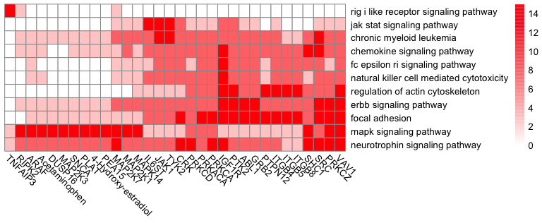

``` r
library(readr)
library(pheatmap)
library(cosmosR)
library(decoupleR)
library(GSEABase)
```

    ## Loading required package: BiocGenerics

    ## 
    ## Attaching package: 'BiocGenerics'

    ## The following objects are masked from 'package:stats':
    ## 
    ##     IQR, mad, sd, var, xtabs

    ## The following objects are masked from 'package:base':
    ## 
    ##     anyDuplicated, append, as.data.frame, basename, cbind, colnames,
    ##     dirname, do.call, duplicated, eval, evalq, Filter, Find, get, grep,
    ##     grepl, intersect, is.unsorted, lapply, Map, mapply, match, mget,
    ##     order, paste, pmax, pmax.int, pmin, pmin.int, Position, rank,
    ##     rbind, Reduce, rownames, sapply, setdiff, sort, table, tapply,
    ##     union, unique, unsplit, which.max, which.min

    ## Loading required package: Biobase

    ## Welcome to Bioconductor
    ## 
    ##     Vignettes contain introductory material; view with
    ##     'browseVignettes()'. To cite Bioconductor, see
    ##     'citation("Biobase")', and for packages 'citation("pkgname")'.

    ## Loading required package: annotate

    ## Loading required package: AnnotationDbi

    ## Loading required package: stats4

    ## Loading required package: IRanges

    ## Loading required package: S4Vectors

    ## 
    ## Attaching package: 'S4Vectors'

    ## The following objects are masked from 'package:base':
    ## 
    ##     expand.grid, I, unname

    ## Loading required package: XML

    ## Loading required package: graph

    ## 
    ## Attaching package: 'graph'

    ## The following object is masked from 'package:XML':
    ## 
    ##     addNode

``` r
full_moon_res_combined <- as.data.frame(
  read_csv("results/cosmos/moon/full_moon_res_combined.csv"))
```

    ## Rows: 3122 Columns: 3
    ## ── Column specification ────────────────────────────────────────────────────────
    ## Delimiter: ","
    ## chr (1): source
    ## dbl (2): score, level
    ## 
    ## ℹ Use `spec()` to retrieve the full column specification for this data.
    ## ℹ Specify the column types or set `show_col_types = FALSE` to quiet this message.

``` r
combined_meta_network_translated <- as.data.frame(
  read_csv("results/cosmos/moon/combined_meta_network_translated.csv"))
```

    ## Rows: 14027 Columns: 3
    ## ── Column specification ────────────────────────────────────────────────────────
    ## Delimiter: ","
    ## chr (2): source, target
    ## dbl (1): interaction
    ## 
    ## ℹ Use `spec()` to retrieve the full column specification for this data.
    ## ℹ Specify the column types or set `show_col_types = FALSE` to quiet this message.

``` r
background_nodes <- full_moon_res_combined[abs(full_moon_res_combined$score) > 1,"source"]
```

``` r
pathway_control_df <- reshape2::dcast(pathway_control_set, pathway~node_of_interest, value.var = "p-value")
row.names(pathway_control_df) <- pathway_control_df$pathway

pathway_control_df <- pathway_control_df[,-1]
pathway_control_df <- pathway_control_df[,apply(pathway_control_df, 2, function(x){min(x) < 0.1})]
```

``` r
threshold_pval <- 0.0000000000000001

pathway_control_df_top <- pathway_control_df[!grepl("CANCER",row.names(pathway_control_df)),]
pathway_control_df_top <- pathway_control_df_top[apply(pathway_control_df_top, 1, function(x){min(x) < threshold_pval}),apply(pathway_control_df_top, 2, function(x){min(x) < threshold_pval})]
pathway_control_df_top <- -log10(pathway_control_df_top)
# pathway_control_df_top[pathway_control_df_top < 3] <- NA
pathway_control_df_top[pathway_control_df_top >= 15] <- 15
pathway_control_df_top[pathway_control_df_top >= 8 & pathway_control_df_top < 15] <- 8
pathway_control_df_top[pathway_control_df_top >= 3 & pathway_control_df_top < 8] <- 3
pathway_control_df_top[pathway_control_df_top <3] <- 0

row.names(pathway_control_df_top) <- tolower(gsub("_"," ",gsub("KEGG","",row.names(pathway_control_df_top))))
names(pathway_control_df_top) <- gsub("Metab__","",gsub("_[a-z$]","",names(pathway_control_df_top)))
pheatmap::pheatmap(pathway_control_df_top, angle_col = 315, na_col = "grey", cluster_rows = T, cluster_cols = T, display_numbers = F, number_color = "black", color = colorRampPalette(c("white","red"))(100), treeheight_row = 0, treeheight_col = 0)
```

<!-- -->

``` r
pheatmap::pheatmap(pathway_control_df_top, angle_col = 315, na_col = "grey", cluster_rows = T, cluster_cols = T, display_numbers = F, number_color = "black", color = colorRampPalette(c("white","red"))(100), treeheight_row = 0, treeheight_col = 0, filename = "results/cosmos/moon/pathway_control_top.pdf", height = 3, width = 9)
```
